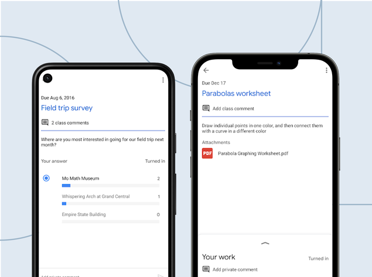

# Tiga Aplikasi yang Dibangun menggunakan Flutter

## Contoh

### Google Pay

### eBay Motors

### Google Classroom

#### Sumber:

- https://9to5google.com/2020/09/18/google-pay-tez-flutter/
- https://flutterappworld.com/ebay-motors-state-management-with-flutter/
- https://flutter.dev/showcase/google-classroom

## Terinstall

### Bank Jago

### Grab

### Access by KAI

